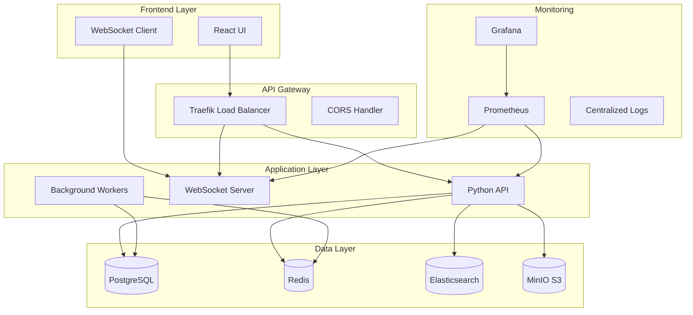

# 🛠️ Development Guide - AI Agent Showcase

This comprehensive guide provides everything you need to understand, contribute to, and extend the AI Agent Showcase project. Whether you're a developer, researcher, or enthusiast, this guide will help you navigate and leverage the full potential of modern AI-assisted development.

## 📖 Table of Contents

- [Project Overview](#project-overview)
- [Architecture & Design](#architecture--design)
- [Development Environment](#development-environment)
- [Code Organization](#code-organization)
- [Contributing Guidelines](#contributing-guidelines)
- [Testing Strategy](#testing-strategy)
- [Deployment & Operations](#deployment--operations)
- [Performance & Optimization](#performance--optimization)
- [Security Considerations](#security-considerations)
- [Troubleshooting](#troubleshooting)

## 🎯 Project Overview

### Mission Statement
To demonstrate the comprehensive capabilities of AI coding assistants through practical, real-world examples that showcase automation, intelligence, and enhanced developer productivity.

### Core Objectives
- **Educational**: Teach best practices in AI-assisted development
- **Practical**: Provide working examples for real-world scenarios
- **Comprehensive**: Cover multiple programming languages and technologies
- **Scalable**: Design patterns that work from prototype to production
- **Maintainable**: Code that's easy to understand, modify, and extend

### Technology Stack

#### Backend Technologies
- **Python**: Data science, ML, API development
- **Node.js**: Real-time applications, web scraping
- **PostgreSQL**: Primary database for structured data
- **Redis**: Caching and session management
- **Elasticsearch**: Search and analytics

#### Frontend Technologies
- **React**: Modern UI components
- **TypeScript**: Type-safe JavaScript development
- **Tailwind CSS**: Utility-first styling
- **D3.js**: Data visualization

#### DevOps & Infrastructure
- **Docker**: Containerization and orchestration
- **Traefik**: Load balancing and reverse proxy
- **Prometheus**: Metrics collection
- **Grafana**: Monitoring dashboards
- **GitHub Actions**: CI/CD pipelines

## 🏗️ Architecture & Design

### System Architecture



### Design Principles

#### 1. Separation of Concerns
- **Presentation Layer**: UI components and user interactions
- **Business Logic**: Core application functionality
- **Data Access**: Database interactions and data management
- **Infrastructure**: Deployment, monitoring, and operations

#### 2. Scalability Patterns
- **Horizontal Scaling**: Stateless services with load balancing
- **Caching Strategy**: Multi-level caching (Redis, application, CDN)
- **Database Optimization**: Read replicas, connection pooling
- **Asynchronous Processing**: Background jobs and message queues

#### 3. Reliability & Resilience
- **Circuit Breakers**: Prevent cascade failures
- **Retry Logic**: Exponential backoff for transient failures
- **Health Checks**: Comprehensive service monitoring
- **Graceful Degradation**: Fallback mechanisms for service failures

## 💻 Development Environment

### Prerequisites
```bash
# System requirements
- Python 3.8+ with pip
- Node.js 18+ with npm
- Docker 20+ with Docker Compose
- Git 2.30+

# Optional but recommended
- PostgreSQL 13+ (for local development)
- Redis 6+ (for local development)
- VS Code with extensions
```

### Local Setup

#### 1. Repository Setup
```bash
# Clone the repository
git clone <repository-url>
cd ai-agent-showcase

# Create development branch
git checkout -b feature/your-feature-name
```

#### 2. Python Environment
```bash
# Create virtual environment
python -m venv venv
source venv/bin/activate  # Linux/Mac
# or
venv\Scripts\activate     # Windows

# Install dependencies
pip install -r examples/config/requirements.txt

# Install development dependencies
pip install -r requirements-dev.txt
```

#### 3. Node.js Environment
```bash
# Install dependencies
npm install

# Install global tools
npm install -g typescript ts-node nodemon

# Verify installation
npm run typecheck
```

#### 4. Docker Environment
```bash
# Build and start services
docker-compose -f examples/config/docker-compose.yml up -d

# Verify services
docker-compose ps
docker-compose logs api
```

### Development Tools Configuration

#### VS Code Settings (`.vscode/settings.json`)
```json
{
  "python.defaultInterpreterPath": "./venv/bin/python",
  "python.linting.enabled": true,
  "python.linting.flake8Enabled": true,
  "python.formatting.provider": "black",
  "typescript.preferences.importModuleSpecifier": "relative",
  "editor.formatOnSave": true,
  "editor.codeActionsOnSave": {
    "source.organizeImports": true
  }
}
```

#### Pre-commit Hooks
```bash
# Install pre-commit
pip install pre-commit

# Setup hooks
pre-commit install

# Run manually
pre-commit run --all-files
```

## 📁 Code Organization

### Directory Structure
```
ai-agent-showcase/
├── examples/
│   ├── python/              # Python examples and demos
│   │   ├── data_analysis.py
│   │   └── __init__.py
│   ├── javascript/          # Node.js examples and demos
│   │   ├── web_scraper.js
│   │   └── package.json
│   ├── config/              # Configuration files
│   │   ├── docker-compose.yml
│   │   ├── requirements.txt
│   │   └── package.json
│   └── docs/                # Documentation and guides
│       └── INTERACTIVE_DEMO.md
├── src/                     # Source code (if applicable)
├── tests/                   # Test files
├── docs/                    # Project documentation
├── .github/                 # GitHub workflows and templates
├── README.md
├── AGENT_CAPABILITIES.md
└── DEVELOPMENT_GUIDE.md
```

### Coding Standards

#### Python Style Guide
```python
# Follow PEP 8 with these additions:
# - Line length: 88 characters (Black default)
# - Use type hints for all functions
# - Comprehensive docstrings for classes and methods
# - Error handling with specific exceptions

from typing import Dict, List, Optional, Union
import logging

logger = logging.getLogger(__name__)

class DataProcessor:
    """
    Processes data with comprehensive error handling and logging.
    
    Args:
        config: Configuration dictionary
        debug: Enable debug logging
    """
    
    def __init__(self, config: Dict[str, Any], debug: bool = False) -> None:
        self.config = config
        self.debug = debug
        if debug:
            logging.basicConfig(level=logging.DEBUG)
    
    def process_data(self, data: List[Dict]) -> Optional[Dict[str, Any]]:
        """
        Process input data and return results.
        
        Args:
            data: List of data dictionaries to process
            
        Returns:
            Processed results or None if processing fails
            
        Raises:
            ValueError: If data format is invalid
            ProcessingError: If processing fails
        """
        try:
            logger.info(f"Processing {len(data)} records")
            # Processing logic here
            return {"status": "success", "count": len(data)}
        except Exception as e:
            logger.error(f"Processing failed: {e}")
            raise ProcessingError(f"Failed to process data: {e}") from e
```

#### TypeScript Style Guide
```typescript
// Use strict TypeScript configuration
// - Enable all strict checks
// - Use explicit return types
// - Prefer interfaces over types for object shapes
// - Use async/await over Promises

interface DataRecord {
  id: string;
  timestamp: Date;
  value: number;
  metadata?: Record<string, unknown>;
}

interface ProcessingOptions {
  batchSize: number;
  timeout: number;
  retries: number;
}

class DataProcessor {
  private readonly config: ProcessingOptions;
  private readonly logger: Logger;

  constructor(config: ProcessingOptions, logger: Logger) {
    this.config = config;
    this.logger = logger;
  }

  async processData(data: DataRecord[]): Promise<ProcessingResult> {
    this.logger.info(`Processing ${data.length} records`);
    
    try {
      const results = await this.batchProcess(data);
      return {
        success: true,
        processedCount: results.length,
        results
      };
    } catch (error) {
      this.logger.error('Processing failed:', error);
      throw new ProcessingError(`Failed to process data: ${error.message}`);
    }
  }

  private async batchProcess(data: DataRecord[]): Promise<ProcessedRecord[]> {
    // Implementation details
  }
}
```

### Error Handling Patterns

#### Python Error Handling
```python
class CustomError(Exception):
    """Base exception for application-specific errors."""
    pass

class ValidationError(CustomError):
    """Raised when data validation fails."""
    pass

class ProcessingError(CustomError):
    """Raised when data processing fails."""
    pass

def safe_process_data(data: Any) -> Result[ProcessedData, str]:
    """
    Safely process data with comprehensive error handling.
    
    Returns:
        Result object containing either success data or error message
    """
    try:
        # Validation
        if not isinstance(data, dict):
            raise ValidationError("Data must be a dictionary")
        
        # Processing
        processed = process_data_internal(data)
        return Result.success(processed)
        
    except ValidationError as e:
        logger.warning(f"Validation failed: {e}")
        return Result.error(f"Invalid data: {e}")
    
    except ProcessingError as e:
        logger.error(f"Processing failed: {e}")
        return Result.error(f"Processing failed: {e}")
    
    except Exception as e:
        logger.critical(f"Unexpected error: {e}")
        return Result.error("An unexpected error occurred")
```

#### TypeScript Error Handling
```typescript
type Result<T, E> = 
  | { success: true; data: T }
  | { success: false; error: E };

class ProcessingService {
  async safeProcessData(data: unknown): Promise<Result<ProcessedData, string>> {
    try {
      // Validation
      const validData = this.validateData(data);
      if (!validData.success) {
        return { success: false, error: validData.error };
      }

      // Processing
      const result = await this.processDataInternal(validData.data);
      return { success: true, data: result };

    } catch (error) {
      this.logger.error('Processing failed:', error);
      return { 
        success: false, 
        error: error instanceof Error ? error.message : 'Unknown error'
      };
    }
  }

  private validateData(data: unknown): Result<ValidData, string> {
    // Validation logic with Zod or similar
    if (!isValidData(data)) {
      return { success: false, error: 'Invalid data format' };
    }
    return { success: true, data };
  }
}
```

## 🤝 Contributing Guidelines

### Getting Started
1. **Fork the repository** and create a feature branch
2. **Set up your development environment** following the setup guide
3. **Review existing code** to understand patterns and conventions
4. **Check the issue tracker** for open issues or feature requests
5. **Discuss major changes** in an issue before starting work

### Pull Request Process

#### 1. Before You Start
- Check if similar work is already in progress
- Create or comment on an issue describing your changes
- Ensure your changes align with project goals

#### 2. Development Process
```bash
# Create feature branch
git checkout -b feature/your-feature-name

# Make your changes
# ... development work ...

# Run tests and linting
npm run test
npm run lint
python -m pytest
flake8 examples/

# Commit with conventional commits
git commit -m "feat: add new data visualization component

- Add interactive charts using D3.js
- Include responsive design patterns
- Add comprehensive unit tests
- Update documentation

Closes #123"
```

#### 3. Pull Request Requirements
- **Code Quality**: All tests pass, linting is clean
- **Documentation**: Update relevant documentation
- **Tests**: Add tests for new functionality
- **Performance**: Consider performance implications
- **Security**: Review for security considerations

#### 4. Review Process
- Automated checks must pass (CI/CD pipeline)
- Code review by at least one maintainer
- Address all review feedback
- Squash commits if requested

### Code Review Guidelines

#### For Contributors
- **Self-review** your code before submitting
- **Write descriptive** PR descriptions
- **Respond promptly** to review feedback
- **Ask questions** if feedback is unclear

#### For Reviewers
- **Be constructive** and specific in feedback
- **Explain the "why"** behind suggestions
- **Consider the bigger picture** and project goals
- **Approve when ready** or request specific changes

## 🧪 Testing Strategy

### Testing Philosophy
- **Test-Driven Development**: Write tests before implementation when possible
- **Comprehensive Coverage**: Aim for >90% code coverage
- **Multiple Test Types**: Unit, integration, and end-to-end tests
- **Continuous Testing**: Automated testing in CI/CD pipeline

### Python Testing

#### Unit Tests with pytest
```python
# tests/test_data_analysis.py
import pytest
from unittest.mock import Mock, patch
from examples.python.data_analysis import DataAnalyzer

class TestDataAnalyzer:
    
    @pytest.fixture
    def analyzer(self):
        return DataAnalyzer(random_state=42)
    
    def test_generate_sample_data(self, analyzer):
        """Test sample data generation."""
        data = analyzer.generate_sample_data(n_samples=100)
        
        assert len(data) == 100
        assert 'feature_1' in data.columns
        assert 'target' in data.columns
        assert data['target'].dtype == 'int64'
    
    def test_exploratory_data_analysis(self, analyzer):
        """Test EDA functionality."""
        analyzer.generate_sample_data(n_samples=50)
        results = analyzer.exploratory_data_analysis()
        
        assert 'shape' in results
        assert 'correlation_matrix' in results
        assert results['shape'] == (50, 7)
    
    @patch('matplotlib.pyplot.show')
    def test_build_predictive_model(self, mock_show, analyzer):
        """Test model building with mocked plotting."""
        analyzer.generate_sample_data(n_samples=200)
        results = analyzer.build_predictive_model()
        
        assert 'test_score' in results
        assert 'feature_importance' in results
        assert 0 <= results['test_score'] <= 1
        mock_show.assert_called()

    def test_invalid_data_handling(self, analyzer):
        """Test error handling for invalid data."""
        with pytest.raises(ValueError, match="No data available"):
            analyzer.exploratory_data_analysis()
```

#### Integration Tests
```python
# tests/integration/test_full_pipeline.py
import pytest
from examples.python.data_analysis import DataAnalyzer

class TestFullPipeline:
    
    def test_complete_analysis_pipeline(self):
        """Test the complete analysis workflow."""
        analyzer = DataAnalyzer(random_state=42)
        
        # Generate data
        data = analyzer.generate_sample_data(n_samples=500)
        assert len(data) == 500
        
        # Perform EDA
        eda_results = analyzer.exploratory_data_analysis()
        assert eda_results['shape'] == (500, 7)
        
        # Build model
        model_results = analyzer.build_predictive_model()
        assert model_results['test_score'] > 0.5  # Reasonable accuracy
        
        # Time series analysis
        ts_results = analyzer.time_series_analysis()
        assert 'daily_stats' in ts_results
```

### JavaScript/TypeScript Testing

#### Unit Tests with Vitest
```typescript
// tests/web_scraper.test.ts
import { describe, it, expect, vi, beforeEach } from 'vitest';
import { WebScraper } from '../examples/javascript/web_scraper.js';

describe('WebScraper', () => {
  let scraper: WebScraper;

  beforeEach(() => {
    scraper = new WebScraper({
      timeout: 5000,
      maxRetries: 2
    });
  });

  it('should initialize with default options', () => {
    const defaultScraper = new WebScraper();
    expect(defaultScraper.options.timeout).toBe(10000);
    expect(defaultScraper.options.maxRetries).toBe(3);
  });

  it('should parse HTML correctly', () => {
    const html = '<html><head><title>Test Page</title></head><body><h1>Header</h1><p>Content</p></body></html>';
    const result = scraper.parseHTML(html);

    expect(result.title).toBe('Test Page');
    expect(result.headings).toHaveLength(1);
    expect(result.headings[0]).toEqual({ level: 1, text: 'Header' });
    expect(result.paragraphs).toContain('Content');
  });

  it('should handle scraping errors gracefully', async () => {
    const invalidUrls = ['invalid-url', 'http://nonexistent.domain'];
    const results = await scraper.scrapeUrls(invalidUrls, 1);

    expect(results).toHaveLength(2);
    expect(results.every(r => !r.success)).toBe(true);
    expect(scraper.errors).toHaveLength(2);
  });
});
```

#### End-to-End Tests
```typescript
// tests/e2e/scraper.e2e.test.ts
import { describe, it, expect } from 'vitest';
import { WebScraper } from '../examples/javascript/web_scraper.js';

describe('WebScraper E2E', () => {
  it('should successfully scrape real URLs', async () => {
    const scraper = new WebScraper({ timeout: 15000 });
    const testUrls = [
      'https://httpbin.org/html',
      'https://httpbin.org/json'
    ];

    const results = await scraper.scrapeUrls(testUrls, 2);
    const analysis = scraper.analyzeData();

    expect(results).toHaveLength(2);
    expect(analysis.summary.successRate).toBe('100.00%');
    expect(analysis.contentAnalysis.averageWordCount).toBeGreaterThan(0);
  }, 30000); // 30 second timeout for network requests
});
```

### Test Configuration

#### pytest Configuration (`pytest.ini`)
```ini
[tool:pytest]
testpaths = tests
python_files = test_*.py
python_classes = Test*
python_functions = test_*
addopts = 
    --verbose
    --cov=examples
    --cov-report=html
    --cov-report=term-missing
    --cov-fail-under=85
markers =
    slow: marks tests as slow (deselect with '-m "not slow"')
    integration: marks tests as integration tests
    e2e: marks tests as end-to-end tests
```

#### Vitest Configuration (`vitest.config.ts`)
```typescript
import { defineConfig } from 'vitest/config';

export default defineConfig({
  test: {
    globals: true,
    environment: 'node',
    coverage: {
      provider: 'v8',
      reporter: ['text', 'html', 'lcov'],
      threshold: {
        global: {
          branches: 80,
          functions: 80,
          lines: 80,
          statements: 80
        }
      }
    },
    testTimeout: 10000,
    hookTimeout: 10000
  }
});
```

## 🚀 Deployment & Operations

### Container Strategy

#### Multi-stage Dockerfile for Python API
```dockerfile
# Dockerfile.python
FROM python:3.11-slim as builder

WORKDIR /app
COPY requirements.txt .
RUN pip install --no-cache-dir --user -r requirements.txt

FROM python:3.11-slim as runtime

# Create non-root user
RUN groupadd -r appuser && useradd -r -g appuser appuser

WORKDIR /app
COPY --from=builder /root/.local /home/appuser/.local
COPY . .

# Security and optimization
RUN chown -R appuser:appuser /app
USER appuser

ENV PATH=/home/appuser/.local/bin:$PATH
ENV PYTHONPATH=/app
ENV PYTHONUNBUFFERED=1

EXPOSE 8000

HEALTHCHECK --interval=30s --timeout=10s --start-period=60s --retries=3 \
  CMD curl -f http://localhost:8000/health || exit 1

CMD ["gunicorn", "--bind", "0.0.0.0:8000", "--workers", "4", "app:app"]
```

#### Multi-stage Dockerfile for Node.js
```dockerfile
# Dockerfile.node
FROM node:18-alpine as builder

WORKDIR /app
COPY package*.json ./
RUN npm ci --only=production && npm cache clean --force

FROM node:18-alpine as runtime

# Security updates and non-root user
RUN apk update && apk upgrade && \
    addgroup -g 1001 -S nodejs && \
    adduser -S nextjs -u 1001

WORKDIR /app
COPY --from=builder --chown=nextjs:nodejs /app/node_modules ./node_modules
COPY --chown=nextjs:nodejs . .

USER nextjs

EXPOSE 3000

HEALTHCHECK --interval=30s --timeout=10s --start-period=60s --retries=3 \
  CMD node healthcheck.js || exit 1

CMD ["node", "server.js"]
```

### Kubernetes Deployment

#### API Deployment
```yaml
# k8s/api-deployment.yaml
apiVersion: apps/v1
kind: Deployment
metadata:
  name: ai-agent-api
  labels:
    app: ai-agent-api
spec:
  replicas: 3
  selector:
    matchLabels:
      app: ai-agent-api
  template:
    metadata:
      labels:
        app: ai-agent-api
    spec:
      containers:
      - name: api
        image: ai-agent-showcase:latest
        ports:
        - containerPort: 8000
        env:
        - name: DATABASE_URL
          valueFrom:
            secretKeyRef:
              name: database-secret
              key: url
        - name: REDIS_URL
          value: "redis://redis-service:6379"
        resources:
          requests:
            memory: "256Mi"
            cpu: "250m"
          limits:
            memory: "512Mi"
            cpu: "500m"
        livenessProbe:
          httpGet:
            path: /health
            port: 8000
          initialDelaySeconds: 30
          periodSeconds: 10
        readinessProbe:
          httpGet:
            path: /ready
            port: 8000
          initialDelaySeconds: 5
          periodSeconds: 5
```

### CI/CD Pipeline

#### GitHub Actions Workflow
```yaml
# .github/workflows/ci-cd.yml
name: CI/CD Pipeline

on:
  push:
    branches: [ main, develop ]
  pull_request:
    branches: [ main ]

jobs:
  test:
    runs-on: ubuntu-latest
    strategy:
      matrix:
        python-version: [3.8, 3.9, 3.10, 3.11]
        node-version: [16, 18, 20]

    steps:
    - uses: actions/checkout@v4

    - name: Set up Python ${{ matrix.python-version }}
      uses: actions/setup-python@v4
      with:
        python-version: ${{ matrix.python-version }}

    - name: Set up Node.js ${{ matrix.node-version }}
      uses: actions/setup-node@v4
      with:
        node-version: ${{ matrix.node-version }}

    - name: Cache Python dependencies
      uses: actions/cache@v3
      with:
        path: ~/.cache/pip
        key: ${{ runner.os }}-pip-${{ hashFiles('**/requirements.txt') }}

    - name: Cache Node dependencies
      uses: actions/cache@v3
      with:
        path: ~/.npm
        key: ${{ runner.os }}-node-${{ hashFiles('**/package-lock.json') }}

    - name: Install Python dependencies
      run: |
        python -m pip install --upgrade pip
        pip install -r examples/config/requirements.txt
        pip install pytest pytest-cov flake8 black mypy

    - name: Install Node dependencies
      run: npm ci

    - name: Lint Python code
      run: |
        flake8 examples/ --count --select=E9,F63,F7,F82 --show-source --statistics
        black --check examples/
        mypy examples/

    - name: Lint JavaScript/TypeScript code
      run: |
        npm run lint
        npm run typecheck

    - name: Run Python tests
      run: |
        pytest examples/ --cov=examples --cov-report=xml

    - name: Run JavaScript tests
      run: |
        npm test -- --coverage

    - name: Upload coverage reports
      uses: codecov/codecov-action@v3
      with:
        files: ./coverage.xml,./coverage/lcov.info

  security:
    runs-on: ubuntu-latest
    steps:
    - uses: actions/checkout@v4

    - name: Run security scan
      uses: securecodewarrior/github-action-add-sarif@v1
      with:
        sarif-file: security-scan-results.sarif

    - name: Python security check
      run: |
        pip install safety bandit
        safety check
        bandit -r examples/

    - name: Node security audit
      run: npm audit --audit-level moderate

  build:
    needs: [test, security]
    runs-on: ubuntu-latest
    if: github.ref == 'refs/heads/main'

    steps:
    - uses: actions/checkout@v4

    - name: Set up Docker Buildx
      uses: docker/setup-buildx-action@v3

    - name: Login to Container Registry
      uses: docker/login-action@v3
      with:
        registry: ghcr.io
        username: ${{ github.actor }}
        password: ${{ secrets.GITHUB_TOKEN }}

    - name: Build and push Docker images
      uses: docker/build-push-action@v5
      with:
        context: .
        push: true
        tags: |
          ghcr.io/${{ github.repository }}:latest
          ghcr.io/${{ github.repository }}:${{ github.sha }}
        cache-from: type=gha
        cache-to: type=gha,mode=max

  deploy:
    needs: build
    runs-on: ubuntu-latest
    if: github.ref == 'refs/heads/main'
    environment: production

    steps:
    - name: Deploy to production
      run: |
        # Deployment script here
        echo "Deploying to production..."
```

### Monitoring & Observability

#### Prometheus Configuration
```yaml
# monitoring/prometheus.yml
global:
  scrape_interval: 15s
  evaluation_interval: 15s

rule_files:
  - "alert_rules.yml"

scrape_configs:
  - job_name: 'ai-agent-api'
    static_configs:
      - targets: ['api:8000']
    metrics_path: '/metrics'
    scrape_interval: 10s

  - job_name: 'websocket-service'
    static_configs:
      - targets: ['websocket:8080']

alerting:
  alertmanagers:
    - static_configs:
        - targets:
          - alertmanager:9093
```

#### Grafana Dashboard Configuration
```json
{
  "dashboard": {
    "title": "AI Agent Showcase Metrics",
    "panels": [
      {
        "title": "Request Rate",
        "type": "graph",
        "targets": [
          {
            "expr": "rate(http_requests_total[5m])",
            "legendFormat": "{{method}} {{endpoint}}"
          }
        ]
      },
      {
        "title": "Response Time",
        "type": "graph",
        "targets": [
          {
            "expr": "histogram_quantile(0.95, rate(http_request_duration_seconds_bucket[5m]))",
            "legendFormat": "95th percentile"
          }
        ]
      },
      {
        "title": "Error Rate",
        "type": "stat",
        "targets": [
          {
            "expr": "rate(http_requests_total{status=~\"5..\"}[5m]) / rate(http_requests_total[5m])",
            "legendFormat": "Error Rate"
          }
        ]
      }
    ]
  }
}
```

## ⚡ Performance & Optimization

### Python Performance

#### Profiling and Optimization
```python
# performance/profiling.py
import cProfile
import pstats
import io
from functools import wraps
from typing import Callable, Any

def profile_function(func: Callable) -> Callable:
    """Decorator to profile function performance."""
    @wraps(func)
    def wrapper(*args, **kwargs) -> Any:
        profiler = cProfile.Profile()
        profiler.enable()
        
        try:
            result = func(*args, **kwargs)
        finally:
            profiler.disable()
            
        # Print profiling results
        s = io.StringIO()
        ps = pstats.Stats(profiler, stream=s)
        ps.sort_stats('cumulative')
        ps.print_stats()
        print(s.getvalue())
        
        return result
    return wrapper

# Memory optimization techniques
import gc
from memory_profiler import profile

@profile
def memory_efficient_processing(data: List[Dict]) -> List[Dict]:
    """Example of memory-efficient data processing."""
    # Process in chunks to reduce memory usage
    chunk_size = 1000
    results = []
    
    for i in range(0, len(data), chunk_size):
        chunk = data[i:i + chunk_size]
        processed_chunk = process_chunk(chunk)
        results.extend(processed_chunk)
        
        # Force garbage collection
        del chunk, processed_chunk
        gc.collect()
    
    return results

def process_chunk(chunk: List[Dict]) -> List[Dict]:
    """Process a chunk of data efficiently."""
    # Use list comprehensions and generators for efficiency
    return [
        {
            'id': item['id'],
            'processed_value': item['value'] * 2,
            'timestamp': item.get('timestamp', 'N/A')
        }
        for item in chunk
        if item.get('value') is not None
    ]
```

#### Database Optimization
```python
# database/optimization.py
from sqlalchemy import create_engine, text
from sqlalchemy.orm import sessionmaker
from sqlalchemy.pool import QueuePool
import redis.connection

class OptimizedDatabase:
    """Database class with performance optimizations."""
    
    def __init__(self, database_url: str):
        # Connection pooling
        self.engine = create_engine(
            database_url,
            poolclass=QueuePool,
            pool_size=20,
            max_overflow=30,
            pool_pre_ping=True,
            pool_recycle=3600,  # 1 hour
            echo=False  # Set to True for SQL debugging
        )
        
        self.SessionLocal = sessionmaker(
            autocommit=False,
            autoflush=False,
            bind=self.engine
        )
    
    def bulk_insert_optimized(self, data: List[Dict]) -> None:
        """Optimized bulk insert using raw SQL."""
        with self.engine.begin() as conn:
            # Use COPY for PostgreSQL or bulk insert for other DBs
            conn.execute(
                text("""
                    INSERT INTO processed_data (id, value, timestamp)
                    VALUES (:id, :value, :timestamp)
                """),
                data
            )
    
    def get_with_caching(self, cache_client: redis.Redis, key: str, query_func: Callable) -> Any:
        """Get data with Redis caching."""
        # Try cache first
        cached_result = cache_client.get(key)
        if cached_result:
            return json.loads(cached_result)
        
        # Query database
        result = query_func()
        
        # Cache result for 1 hour
        cache_client.setex(key, 3600, json.dumps(result, default=str))
        
        return result
```

### JavaScript/Node.js Performance

#### Async Optimization
```typescript
// performance/async-optimization.ts
import { Worker } from 'worker_threads';
import cluster from 'cluster';
import os from 'os';

class PerformanceOptimizer {
  private readonly maxConcurrency: number;

  constructor(maxConcurrency?: number) {
    this.maxConcurrency = maxConcurrency || os.cpus().length;
  }

  // Concurrent processing with rate limiting
  async processConcurrently<T, R>(
    items: T[],
    processor: (item: T) => Promise<R>,
    concurrency: number = this.maxConcurrency
  ): Promise<R[]> {
    const results: R[] = [];
    const executing: Promise<void>[] = [];

    for (const item of items) {
      const promise = processor(item).then(result => {
        results.push(result);
      });

      executing.push(promise);

      if (executing.length >= concurrency) {
        await Promise.race(executing);
        executing.splice(executing.findIndex(p => p === promise), 1);
      }
    }

    await Promise.all(executing);
    return results;
  }

  // Worker thread for CPU-intensive tasks
  async processWithWorker<T, R>(data: T, workerScript: string): Promise<R> {
    return new Promise((resolve, reject) => {
      const worker = new Worker(workerScript, {
        workerData: data
      });

      worker.on('message', resolve);
      worker.on('error', reject);
      worker.on('exit', (code) => {
        if (code !== 0) {
          reject(new Error(`Worker stopped with exit code ${code}`));
        }
      });
    });
  }

  // Memory-efficient streaming
  async *processStream<T, R>(
    stream: AsyncIterable<T>,
    processor: (item: T) => Promise<R>
  ): AsyncGenerator<R, void, unknown> {
    for await (const item of stream) {
      yield await processor(item);
    }
  }
}

// Cluster setup for multi-core utilization
if (cluster.isPrimary) {
  const numCPUs = os.cpus().length;
  
  console.log(`Master ${process.pid} is running`);
  
  // Fork workers
  for (let i = 0; i < numCPUs; i++) {
    cluster.fork();
  }
  
  cluster.on('exit', (worker, code, signal) => {
    console.log(`Worker ${worker.process.pid} died`);
    cluster.fork(); // Restart worker
  });
} else {
  // Worker process
  console.log(`Worker ${process.pid} started`);
  // Start your application here
}
```

#### Caching Strategies
```typescript
// performance/caching.ts
import NodeCache from 'node-cache';
import Redis from 'ioredis';

class CacheManager {
  private memoryCache: NodeCache;
  private redisCache: Redis;

  constructor(redisUrl: string) {
    // Memory cache for frequently accessed small data
    this.memoryCache = new NodeCache({
      stdTTL: 600, // 10 minutes
      checkperiod: 120, // Check for expired keys every 2 minutes
      maxKeys: 1000
    });

    // Redis for distributed caching
    this.redisCache = new Redis(redisUrl, {
      retryDelayOnFailover: 100,
      maxRetriesPerRequest: 3,
      lazyConnect: true
    });
  }

  async get<T>(key: string): Promise<T | null> {
    // Try memory cache first
    const memoryResult = this.memoryCache.get<T>(key);
    if (memoryResult !== undefined) {
      return memoryResult;
    }

    // Try Redis cache
    try {
      const redisResult = await this.redisCache.get(key);
      if (redisResult) {
        const parsed = JSON.parse(redisResult) as T;
        // Store in memory cache for faster future access
        this.memoryCache.set(key, parsed);
        return parsed;
      }
    } catch (error) {
      console.warn('Redis cache error:', error);
    }

    return null;
  }

  async set<T>(key: string, value: T, ttl: number = 600): Promise<void> {
    // Set in both caches
    this.memoryCache.set(key, value, ttl);
    
    try {
      await this.redisCache.setex(key, ttl, JSON.stringify(value));
    } catch (error) {
      console.warn('Redis cache set error:', error);
    }
  }

  async invalidate(pattern: string): Promise<void> {
    // Clear memory cache
    this.memoryCache.flushAll();

    // Clear Redis cache with pattern
    try {
      const keys = await this.redisCache.keys(pattern);
      if (keys.length > 0) {
        await this.redisCache.del(...keys);
      }
    } catch (error) {
      console.warn('Redis cache invalidation error:', error);
    }
  }
}
```

## 🔒 Security Considerations

### Authentication & Authorization

#### JWT Implementation
```python
# security/auth.py
import jwt
import bcrypt
from datetime import datetime, timedelta
from typing import Optional, Dict, Any
import secrets

class AuthManager:
    """Secure authentication and authorization manager."""
    
    def __init__(self, secret_key: str, algorithm: str = 'HS256'):
        self.secret_key = secret_key
        self.algorithm = algorithm
        self.token_expiry = timedelta(hours=24)
    
    def hash_password(self, password: str) -> str:
        """Hash password using bcrypt."""
        salt = bcrypt.gensalt()
        return bcrypt.hashpw(password.encode('utf-8'), salt).decode('utf-8')
    
    def verify_password(self, password: str, hashed: str) -> bool:
        """Verify password against hash."""
        return bcrypt.checkpw(password.encode('utf-8'), hashed.encode('utf-8'))
    
    def generate_token(self, user_id: str, permissions: List[str] = None) -> str:
        """Generate JWT token with user information."""
        payload = {
            'user_id': user_id,
            'permissions': permissions or [],
            'exp': datetime.utcnow() + self.token_expiry,
            'iat': datetime.utcnow(),
            'jti': secrets.token_urlsafe(32)  # Unique token ID
        }
        
        return jwt.encode(payload, self.secret_key, algorithm=self.algorithm)
    
    def verify_token(self, token: str) -> Optional[Dict[str, Any]]:
        """Verify and decode JWT token."""
        try:
            payload = jwt.decode(token, self.secret_key, algorithms=[self.algorithm])
            return payload
        except jwt.ExpiredSignatureError:
            raise AuthenticationError("Token has expired")
        except jwt.InvalidTokenError:
            raise AuthenticationError("Invalid token")
    
    def require_permission(self, required_permission: str):
        """Decorator to require specific permission."""
        def decorator(func):
            @wraps(func)
            def wrapper(*args, **kwargs):
                # Extract token from request headers
                token = extract_token_from_request()
                payload = self.verify_token(token)
                
                if required_permission not in payload.get('permissions', []):
                    raise AuthorizationError(f"Permission '{required_permission}' required")
                
                return func(*args, **kwargs)
            return wrapper
        return decorator
```

### Input Validation & Sanitization

#### Python Validation with Pydantic
```python
# security/validation.py
from pydantic import BaseModel, validator, Field
from typing import Optional, List
import re
import html

class UserInput(BaseModel):
    """Validated user input model."""
    
    username: str = Field(..., min_length=3, max_length=50)
    email: str = Field(..., regex=r'^[a-zA-Z0-9._%+-]+@[a-zA-Z0-9.-]+\.[a-zA-Z]{2,}$')
    age: int = Field(..., ge=13, le=120)  # Age between 13 and 120
    bio: Optional[str] = Field(None, max_length=500)
    tags: List[str] = Field(default_factory=list, max_items=10)
    
    @validator('username')
    def validate_username(cls, v):
        """Validate username format."""
        if not re.match(r'^[a-zA-Z0-9_-]+$', v):
            raise ValueError('Username can only contain letters, numbers, underscores, and hyphens')
        return v.lower()
    
    @validator('bio')
    def sanitize_bio(cls, v):
        """Sanitize bio content."""
        if v:
            # HTML escape to prevent XSS
            return html.escape(v.strip())
        return v
    
    @validator('tags')
    def validate_tags(cls, v):
        """Validate and sanitize tags."""
        sanitized_tags = []
        for tag in v:
            # Remove special characters and limit length
            clean_tag = re.sub(r'[^a-zA-Z0-9_-]', '', tag)[:20]
            if clean_tag:
                sanitized_tags.append(clean_tag.lower())
        return sanitized_tags

class DataProcessor:
    """Secure data processing with validation."""
    
    def process_user_data(self, raw_data: dict) -> UserInput:
        """Process and validate user data."""
        try:
            # Validate input using Pydantic
            validated_data = UserInput(**raw_data)
            return validated_data
        except ValidationError as e:
            # Log validation errors (but don't expose details to client)
            logger.warning(f"Validation failed: {e}")
            raise ValueError("Invalid input data")
```

#### TypeScript Validation with Zod
```typescript
// security/validation.ts
import { z } from 'zod';
import DOMPurify from 'isomorphic-dompurify';

// Define validation schemas
const UserInputSchema = z.object({
  username: z.string()
    .min(3, 'Username must be at least 3 characters')
    .max(50, 'Username must be less than 50 characters')
    .regex(/^[a-zA-Z0-9_-]+$/, 'Username contains invalid characters'),
  
  email: z.string()
    .email('Invalid email format')
    .max(255, 'Email too long'),
  
  age: z.number()
    .int('Age must be an integer')
    .min(13, 'Must be at least 13 years old')
    .max(120, 'Invalid age'),
  
  bio: z.string()
    .max(500, 'Bio must be less than 500 characters')
    .optional(),
  
  tags: z.array(z.string().max(20))
    .max(10, 'Too many tags')
    .default([])
});

type UserInput = z.infer<typeof UserInputSchema>;

class ValidationService {
  static validateUserInput(data: unknown): UserInput {
    try {
      const validated = UserInputSchema.parse(data);
      
      // Sanitize string fields
      return {
        ...validated,
        username: validated.username.toLowerCase(),
        bio: validated.bio ? DOMPurify.sanitize(validated.bio) : undefined,
        tags: validated.tags.map(tag => 
          tag.replace(/[^a-zA-Z0-9_-]/g, '').toLowerCase()
        ).filter(tag => tag.length > 0)
      };
    } catch (error) {
      if (error instanceof z.ZodError) {
        throw new ValidationError('Invalid input data', error.errors);
      }
      throw error;
    }
  }

  static sanitizeHtml(input: string): string {
    return DOMPurify.sanitize(input, {
      ALLOWED_TAGS: ['b', 'i', 'em', 'strong', 'p', 'br'],
      ALLOWED_ATTR: []
    });
  }

  static validateFileUpload(file: Express.Multer.File): void {
    const allowedTypes = ['image/jpeg', 'image/png', 'image/gif'];
    const maxSize = 5 * 1024 * 1024; // 5MB

    if (!allowedTypes.includes(file.mimetype)) {
      throw new ValidationError('Invalid file type');
    }

    if (file.size > maxSize) {
      throw new ValidationError('File too large');
    }

    // Additional security checks
    if (file.originalname.includes('..') || file.originalname.includes('/')) {
      throw new ValidationError('Invalid filename');
    }
  }
}

class ValidationError extends Error {
  constructor(message: string, public details?: any) {
    super(message);
    this.name = 'ValidationError';
  }
}
```

### SQL Injection Prevention

#### Parameterized Queries
```python
# security/database.py
from sqlalchemy import text
from typing import List, Dict, Any

class SecureDatabase:
    """Database class with SQL injection prevention."""
    
    def __init__(self, engine):
        self.engine = engine
    
    def safe_query(self, query: str, params: Dict[str, Any] = None) -> List[Dict]:
        """Execute parameterized query safely."""
        with self.engine.connect() as conn:
            # Use parameterized queries to prevent SQL injection
            result = conn.execute(text(query), params or {})
            return [dict(row) for row in result]
    
    def search_users(self, search_term: str, limit: int = 10) -> List[Dict]:
        """Safe user search with parameterized query."""
        query = """
            SELECT id, username, email 
            FROM users 
            WHERE username ILIKE :search_term 
               OR email ILIKE :search_term
            LIMIT :limit
        """
        
        params = {
            'search_term': f'%{search_term}%',
            'limit': limit
        }
        
        return self.safe_query(query, params)
    
    def get_user_data(self, user_id: int) -> Optional[Dict]:
        """Get user data with proper validation."""
        # Validate input
        if not isinstance(user_id, int) or user_id <= 0:
            raise ValueError("Invalid user ID")
        
        query = "SELECT * FROM users WHERE id = :user_id"
        results = self.safe_query(query, {'user_id': user_id})
        
        return results[0] if results else None
```

### Rate Limiting & DDoS Protection

#### Rate Limiting Implementation
```python
# security/rate_limiting.py
import time
import redis
from typing import Optional
from functools import wraps

class RateLimiter:
    """Redis-based rate limiter."""
    
    def __init__(self, redis_client: redis.Redis):
        self.redis = redis_client
    
    def is_allowed(self, key: str, limit: int, window: int) -> bool:
        """Check if request is within rate limit."""
        current_time = int(time.time())
        pipeline = self.redis.pipeline()
        
        # Sliding window rate limiting
        pipeline.zremrangebyscore(key, 0, current_time - window)
        pipeline.zcard(key)
        pipeline.zadd(key, {str(current_time): current_time})
        pipeline.expire(key, window)
        
        results = pipeline.execute()
        current_requests = results[1]
        
        return current_requests < limit
    
    def rate_limit(self, limit: int, window: int, key_func=None):
        """Decorator for rate limiting."""
        def decorator(func):
            @wraps(func)
            def wrapper(*args, **kwargs):
                # Generate rate limit key
                if key_func:
                    key = key_func(*args, **kwargs)
                else:
                    key = f"rate_limit:{func.__name__}:default"
                
                if not self.is_allowed(key, limit, window):
                    raise RateLimitExceeded(f"Rate limit exceeded: {limit} requests per {window} seconds")
                
                return func(*args, **kwargs)
            return wrapper
        return decorator

# Usage example
rate_limiter = RateLimiter(redis_client)

@rate_limiter.rate_limit(limit=100, window=60)  # 100 requests per minute
def api_endpoint():
    return {"message": "Success"}

# Per-user rate limiting
@rate_limiter.rate_limit(
    limit=10, 
    window=60, 
    key_func=lambda user_id: f"user:{user_id}"
)
def user_specific_endpoint(user_id: str):
    return {"message": f"Hello user {user_id}"}
```

## 🔧 Troubleshooting

### Common Issues & Solutions

#### Python Environment Issues

**Issue**: Module not found errors
```bash
# Solution 1: Check virtual environment
which python
which pip
pip list | grep module-name

# Solution 2: Reinstall in virtual environment
deactivate
rm -rf venv
python -m venv venv
source venv/bin/activate
pip install -r requirements.txt
```

**Issue**: Memory errors with large datasets
```python
# Solution: Process data in chunks
def process_large_dataset(file_path: str, chunk_size: int = 10000):
    """Process large datasets in chunks to avoid memory issues."""
    import pandas as pd
    
    results = []
    for chunk in pd.read_csv(file_path, chunksize=chunk_size):
        processed_chunk = process_chunk(chunk)
        results.append(processed_chunk)
        
        # Optional: Save intermediate results
        chunk.to_csv(f'temp_chunk_{len(results)}.csv', index=False)
    
    return pd.concat(results, ignore_index=True)
```

#### Node.js Issues

**Issue**: Node.js version conflicts
```bash
# Solution: Use Node Version Manager
curl -o- https://raw.githubusercontent.com/nvm-sh/nvm/v0.39.0/install.sh | bash
nvm install 18
nvm use 18
npm install
```

**Issue**: Memory leaks in long-running processes
```javascript
// Solution: Monitor and cleanup
class MemoryMonitor {
  constructor(threshold = 1000 * 1024 * 1024) { // 1GB
    this.threshold = threshold;
    this.startMonitoring();
  }

  startMonitoring() {
    setInterval(() => {
      const usage = process.memoryUsage();
      console.log('Memory usage:', {
        rss: Math.round(usage.rss / 1024 / 1024) + 'MB',
        heapUsed: Math.round(usage.heapUsed / 1024 / 1024) + 'MB',
        heapTotal: Math.round(usage.heapTotal / 1024 / 1024) + 'MB'
      });

      if (usage.heapUsed > this.threshold) {
        console.warn('High memory usage detected!');
        if (global.gc) {
          global.gc();
        }
      }
    }, 30000); // Check every 30 seconds
  }
}

// Start monitoring
const monitor = new MemoryMonitor();
```

#### Docker Issues

**Issue**: Container build failures
```bash
# Solution: Debug build process
docker build --no-cache --progress=plain -t app .

# Check for common issues
docker system df  # Check disk space
docker system prune  # Clean up unused resources

# Build with specific platform
docker build --platform linux/amd64 -t app .
```

**Issue**: Container networking problems
```bash
# Solution: Debug networking
docker network ls
docker inspect network_name

# Test connectivity between containers
docker exec container1 ping container2
docker exec container1 nslookup container2
```

#### Database Connection Issues

**Issue**: Connection pool exhaustion
```python
# Solution: Proper connection management
from contextlib import contextmanager
from sqlalchemy.orm import sessionmaker

@contextmanager
def get_db_session():
    """Context manager for database sessions."""
    session = SessionLocal()
    try:
        yield session
        session.commit()
    except Exception:
        session.rollback()
        raise
    finally:
        session.close()

# Usage
def get_user(user_id: int):
    with get_db_session() as session:
        return session.query(User).filter(User.id == user_id).first()
```

### Debugging Techniques

#### Python Debugging
```python
# debugging/python_debug.py
import pdb
import logging
import traceback
from functools import wraps

# Set up comprehensive logging
logging.basicConfig(
    level=logging.DEBUG,
    format='%(asctime)s - %(name)s - %(levelname)s - %(message)s',
    handlers=[
        logging.FileHandler('debug.log'),
        logging.StreamHandler()
    ]
)

def debug_function(func):
    """Decorator to add debugging to functions."""
    @wraps(func)
    def wrapper(*args, **kwargs):
        logger = logging.getLogger(func.__module__)
        logger.debug(f"Calling {func.__name__} with args: {args}, kwargs: {kwargs}")
        
        try:
            result = func(*args, **kwargs)
            logger.debug(f"{func.__name__} returned: {result}")
            return result
        except Exception as e:
            logger.error(f"Error in {func.__name__}: {e}")
            logger.error(f"Traceback: {traceback.format_exc()}")
            raise
    
    return wrapper

# Usage
@debug_function
def problematic_function(data):
    # Your code here
    if not data:
        raise ValueError("Data cannot be empty")
    return process_data(data)

# Interactive debugging
def debug_here():
    """Drop into debugger at this point."""
    pdb.set_trace()

# Example usage in code
def complex_function(data):
    processed = initial_processing(data)
    
    # Debug point
    debug_here()  # Execution will pause here
    
    result = final_processing(processed)
    return result
```

#### JavaScript Debugging
```javascript
// debugging/javascript_debug.js
const debug = require('debug');

// Create namespaced debuggers
const dbDebug = debug('app:database');
const apiDebug = debug('app:api');
const errorDebug = debug('app:error');

class DebugHelper {
  static logPerformance(label, fn) {
    return async function(...args) {
      const start = performance.now();
      
      try {
        const result = await fn.apply(this, args);
        const end = performance.now();
        
        console.log(`${label} took ${end - start} milliseconds`);
        return result;
      } catch (error) {
        const end = performance.now();
        console.error(`${label} failed after ${end - start} milliseconds:`, error);
        throw error;
      }
    };
  }

  static memoryUsage() {
    const usage = process.memoryUsage();
    return {
      rss: `${Math.round(usage.rss / 1024 / 1024)} MB`,
      heapUsed: `${Math.round(usage.heapUsed / 1024 / 1024)} MB`,
      heapTotal: `${Math.round(usage.heapTotal / 1024 / 1024)} MB`,
      external: `${Math.round(usage.external / 1024 / 1024)} MB`
    };
  }

  static async debugRequest(req, res, next) {
    const start = Date.now();
    
    apiDebug(`${req.method} ${req.url} - Start`);
    apiDebug('Headers:', req.headers);
    apiDebug('Body:', req.body);
    
    res.on('finish', () => {
      const duration = Date.now() - start;
      apiDebug(`${req.method} ${req.url} - ${res.statusCode} - ${duration}ms`);
    });
    
    next();
  }
}

// Usage examples
const optimizedFunction = DebugHelper.logPerformance(
  'Data Processing',
  async function(data) {
    // Your async function here
    return processData(data);
  }
);

// Memory monitoring
setInterval(() => {
  console.log('Memory usage:', DebugHelper.memoryUsage());
}, 60000); // Every minute

module.exports = DebugHelper;
```

### Performance Debugging

#### Profiling Tools Setup
```bash
# Python profiling
pip install py-spy memory-profiler line-profiler

# Profile running Python process
py-spy record -o profile.svg --pid 12345

# Memory profiling
mprof run python your_script.py
mprof plot

# Node.js profiling
npm install -g clinic
clinic doctor -- node app.js
clinic flame -- node app.js
clinic bubbleprof -- node app.js
```

#### Custom Performance Monitoring
```python
# monitoring/performance.py
import time
import psutil
import threading
from collections import defaultdict, deque
from typing import Dict, List

class PerformanceMonitor:
    """Real-time performance monitoring."""
    
    def __init__(self, history_size: int = 1000):
        self.metrics = defaultdict(deque)
        self.history_size = history_size
        self.start_time = time.time()
        self.running = False
        
    def start_monitoring(self):
        """Start background monitoring thread."""
        self.running = True
        thread = threading.Thread(target=self._monitor_loop, daemon=True)
        thread.start()
        
    def stop_monitoring(self):
        """Stop monitoring."""
        self.running = False
        
    def _monitor_loop(self):
        """Background monitoring loop."""
        while self.running:
            # Collect system metrics
            cpu_percent = psutil.cpu_percent()
            memory_info = psutil.virtual_memory()
            disk_info = psutil.disk_usage('/')
            
            timestamp = time.time()
            
            # Store metrics
            self._add_metric('cpu_percent', timestamp, cpu_percent)
            self._add_metric('memory_used_mb', timestamp, memory_info.used / 1024 / 1024)
            self._add_metric('memory_percent', timestamp, memory_info.percent)
            self._add_metric('disk_used_gb', timestamp, disk_info.used / 1024 / 1024 / 1024)
            
            time.sleep(5)  # Collect every 5 seconds
            
    def _add_metric(self, name: str, timestamp: float, value: float):
        """Add metric to history."""
        metric_queue = self.metrics[name]
        metric_queue.append((timestamp, value))
        
        # Limit history size
        while len(metric_queue) > self.history_size:
            metric_queue.popleft()
            
    def get_current_metrics(self) -> Dict[str, float]:
        """Get current system metrics."""
        return {
            'uptime_seconds': time.time() - self.start_time,
            'cpu_percent': psutil.cpu_percent(),
            'memory_percent': psutil.virtual_memory().percent,
            'disk_percent': psutil.disk_usage('/').percent,
            'active_threads': threading.active_count()
        }
        
    def get_metric_history(self, metric_name: str, minutes: int = 10) -> List[tuple]:
        """Get metric history for specified time period."""
        cutoff_time = time.time() - (minutes * 60)
        metric_queue = self.metrics[metric_name]
        
        return [
            (timestamp, value) 
            for timestamp, value in metric_queue 
            if timestamp >= cutoff_time
        ]

# Usage
monitor = PerformanceMonitor()
monitor.start_monitoring()

# In your application
def get_system_health():
    return monitor.get_current_metrics()
```

---

This comprehensive development guide provides the foundation for understanding, contributing to, and extending the AI Agent Showcase project. For additional help or questions, please refer to the project's issue tracker or contact the maintainers.

Remember to always follow security best practices, write comprehensive tests, and maintain clear documentation for any contributions to the project.